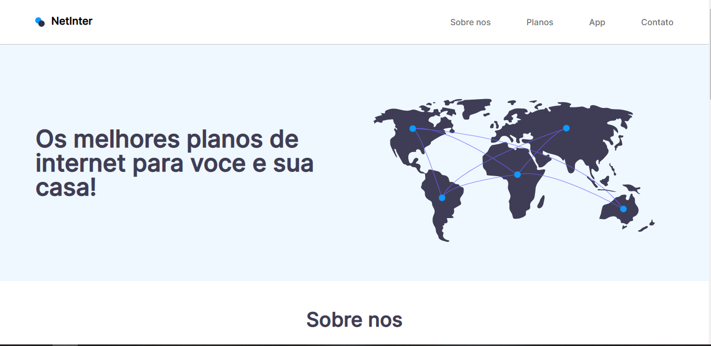

<h1 align="center">
  NetInter operadora de internet fictícia 
</h1>

<h4 align="center">
  🛠️ Em construção 
</h4>

  <a href="https://willianstephano.github.io/NetInter/">
    <b>🚀 Visualizar</b>
  </a>
  &nbsp;&nbsp;▪&nbsp;&nbsp;
  <a href="https://github.com/WillianStephano/NetInter">
    <b>💻 Repositório</b>
  </a>

  

<h6 align="center">
 Projeto foi desenvolvido com intuito de aprimirar minhas habilidades em HTML e CSS.
</h6>

Desenvolvido por Willian Stephano
