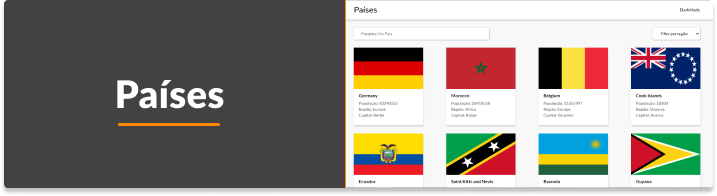
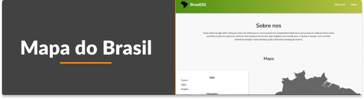
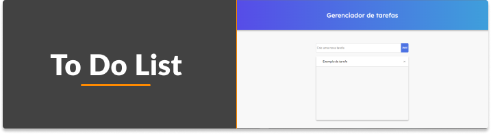
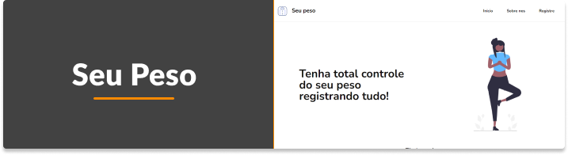
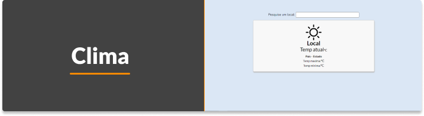
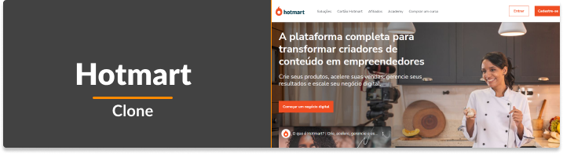
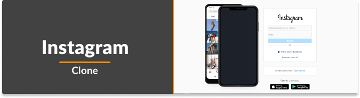

<h1 align="center">
  💻 Meus Projetos
</h1>

<h3 align="center">
  Repositorio criado com o objetivo de apresentar meus projetos ao decorrer da minha trajetoria de estudos.
</h3>

<h5 align="center">
 Lista de projetos desenvolvidos:
</h5>

<ul>
  <li><a href="https://github.com/WillianStephano/Adote-um-Amigo">Adote um amigo </a></li>
  <li><a href="https://github.com/WillianStephano/Fatec-Cotia__Clone">Fatec de Cotia - Clone</a></li>
  <li><a href="https://github.com/WillianStephano/Cartolol__Clone">Cartolol - Clone</a></li>
  <li><a href="https://github.com/WillianStephano/Facebook__Clone/">Facebook Login - Clone</a></li>
  <li><a href="https://github.com/WillianStephano/Hotmart__Clone/">Hotmart - Clone</a></li>
  <li><a href="https://github.com/WillianStephano/NetInter">NetInter</a></li>
  <li><a href="https://github.com/WillianStephano/Instagram-Clone">Instagram - Clone</a></li>
  <li><a href="https://github.com/WillianStephano/RecodePro-Clone">RecodePro - Clone</a></li>
  <li><a href="https://github.com/WillianStephano/SescSP-Clone">Sesc Sp - Clone</a></li>
  <li><a href="https://github.com/WillianStephano/Seu-Peso">SeuPeso</a></li>
  <li><a href="https://github.com/WillianStephano/DoctorCare">DoctorCare</a></li>
  <li><a href="https://github.com/WillianStephano/To-Do-List">To Do List</a></li>
  <li><a href="https://github.com/WillianStephano/Orkut-Clone">Orkut - Clone</a></li>
  <li><a href="https://github.com/WillianStephano/Mapa-do-Brasil">Mapa do Brasil</a></li>
  <li><a href="https://github.com/WillianStephano/Paises">Países</a></li>
</ul>

<h3 align="center">
  Principais projetos
</h3>
<h6 align="center">
  Clique e seja direcionado para o repositorio
</h6>

 

<a href="https://github.com/WillianStephano/Paises">
  <h4 align="center">Países</h4>
  

    
  

</a>

<a href="https://github.com/WillianStephano/Mapa-do-Brasil">
  <h4 align="center">Mapa do Brasil</h4>
  

    
  

</a>

<a href="https://github.com/WillianStephano/To-do-List">
  <h4 align="center">To do List</h4>
  

    
  

</a>

<a href="https://github.com/WillianStephano/Seu-Peso">
  <h4 align="center">Seu Peso</h4>
  

    
  

</a>

<a href="https://github.com/WillianStephano/Clima">
  <h4 align="center">Clima</h4>
  

    
  

</a>

<a href="https://github.com/WillianStephano/Portfolio">
  <h4 align="center">Portfolio</h4>
  

    
  

</a>

<a href="https://github.com/WillianStephano/Hotmart__Clone">
  <h4 align="center">Hotmart - Clone</h4>
  

    
  

</a>

<a href="https://github.com/WillianStephano/Instagram-Clone">
  <h4 align="center">Instagram - Clone</h4>
  

    
  

</a>

